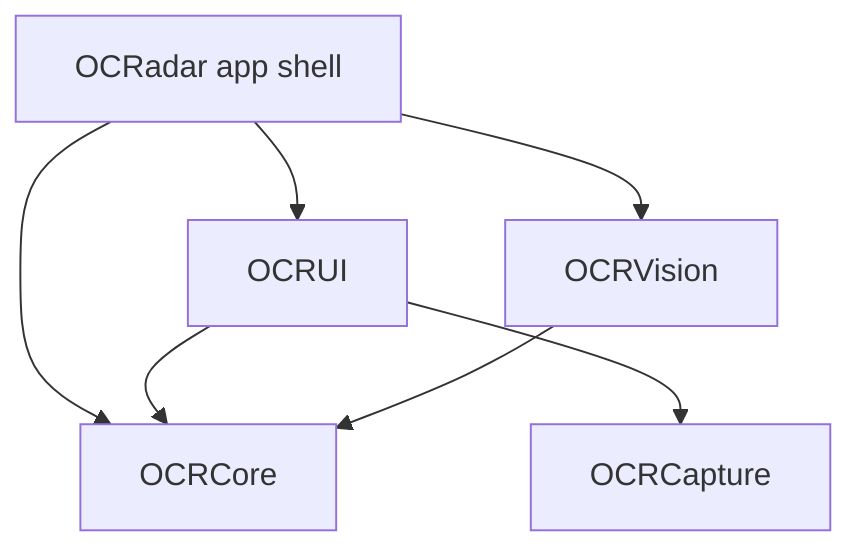

# OCRadar

An awareness tool for the mouth, on iPhone: photograph a spot, see which reference categories it looks most similar to, and decide whether to ask a professional about it — all on device, with nothing ever leaving the phone.

> [!WARNING]
> **OCRadar is an awareness tool, not a diagnosis. Only a dentist or physician can examine a lesion.**
>
> It is not a medical device, and it has not been reviewed or evaluated by the FDA or any other regulator. It does not screen for, detect, diagnose, assess, or rule out any condition, including cancer. What it does is compare a photo against reference images and show which categories look similar — and that comparison **can be wrong in both directions**: it can point at something completely harmless, and it can miss something serious. Never delay care because of what it shows. If something in your mouth concerns you, get it looked at, whatever this app says.

The canonical user-facing wording lives in [`MedicalDisclaimer`](OCRadarKit/Sources/OCRCore/MedicalDisclaimer.swift) and is the single source of truth for what the app claims about itself; call sites pass those strings verbatim and never paraphrase. In-product it appears at each moment of consequence and nowhere else: the full statement gates first launch and must be acknowledged before anything else; a capture-time line sets the expectation before the shutter; a one-line lead sits directly beside the result on both result surfaces, in a bordered notice carrying a link that opens the full statement again; and the compact banner is on Home and in Settings. A wall of warnings trains people to skip all of them, so restraint is part of the design — one notice per surface, at the moment it is read.

If you are preparing a submission, read [`docs/APP_STORE.md`](docs/APP_STORE.md) before you write a single line of listing copy: the same rules bind the App Store description, subtitle, keywords, and screenshots.

## Features

- **Live camera capture** — back wide-angle camera with a glass shutter, gravity-aligned photo orientation, and an interruption-aware session state machine (phone calls, Split View, system pressure, permission denial all surface as distinct UI states).
- **Photo-library import** — run an existing photo through the same flow via `PhotosPicker`, with EXIF orientation normalized before inference. This is also the fallback on devices without a camera (e.g. the Simulator).
- **Capture review** — every photo gets a retake/compare step before anything runs.
- **On-device inference behind a single seam** — the `LesionClassifying` protocol is implemented by a Core ML + Vision backend when a trained model is bundled, and by a deterministic mock otherwise. The mock ships with five demo reference categories (healthy, aphthous ulcer, lichen planus, leukoplakia, erythroplakia).
- **Results presented as a visual comparison** — a similarity percentage read together with the words "visual similarity", the closest-matching reference category below it, a similarity ranking across every category, and a next-step line. The manifest's plain-language description of the category is shown when a trained model produced the result, and withheld for demo results so a fabricated score never borrows real guidance. The app never states what a lesion is.
- **Next-step guidance, not a severity rating** — each reference category carries a tier that is rendered as an action ("Routine", "Worth asking about", "See a professional soon"), because the only useful thing this app can tell someone is whether and how soon to ask a professional. The `low`/`moderate`/`high` raw values are frozen for storage and for the manifest schema; the reframing lives in the label.
- **Scan history** — every comparison is saved locally with SwiftData (JPEG thumbnails in external storage), with a detail view and swipe-to-delete.
- **Private by construction** — all processing happens on device; the app contains no networking code. Photos and results never leave the phone.
- **Demo mode, clearly labeled** — until a trained model is installed, the Home tab shows a "Demo mode — no trained model installed" card and Settings reports the Engine row as "Demo" with the version `mock-0.0.0`. Demo output is derived from image dimensions, not image content, so **every photo of the same size returns the same numbers** — every surface that shows a demo score says so, because a figure that repeats without explanation reads as a finding that has been confirmed.
- **Liquid Glass UI** — SwiftUI throughout, portrait iPhone, a single glass-card treatment shared across all screens.

## Requirements

- **Xcode 27** (the project was created with Tools 27.0 and uses project format 77)
- **iOS 26** deployment target; iPhone only, portrait orientation
- Swift 6 language mode; the `OCRadarKit` package uses Swift tools 6.2
- A **physical iPhone** for camera capture — the Simulator has no camera, so the app offers photo-library import there instead
- For model work only: nothing. The training, evaluation and Core ML export pipeline lives in a separate repository, [OCRadar/Model](https://github.com/OCRadar/Model) — this repo builds and runs without it

## Getting started

```bash
git clone <repo-url>
cd OCR-iOS
open OCRadar.xcodeproj
```

Select the `OCRadar` scheme and run. No further setup is needed: **without a trained model the app launches in clearly-labeled demo mode**, backed by a deterministic mock classifier, so every screen is fully navigable. Install a trained model (next section) and the app loads it in the background at launch, switching from demo mode to real Core ML inference as soon as it is ready.

## Training your own model

The model pipeline lives in its own repository: **[OCRadar/Model](https://github.com/OCRadar/Model)**. It covers dataset layout and provenance, ingest, source-level splitting, training, held-out evaluation with calibration, the abstain threshold, Core ML export, and the generated model card. Start with its `DATASET_SPEC.md` before collecting any images.

What this repo cares about is the two files that come out of it, and where they go:

```bash
# In the Model repo, after training and evaluating:
python -m ocradar_ml.export \
  --checkpoint runs/exp/best.pt --classes runs/exp/classes.json \
  --labels labels.example.yaml --report runs/exp/report.json \
  --model-version 1.0.0 --out dist

# Then install into this repo:
mkdir -p OCRadar/Resources/ML
cp -R <Model-repo>/dist/OralLesionClassifier.mlpackage OCRadar/Resources/ML/
cp <Model-repo>/dist/ModelManifest.json OCRadar/Resources/ML/
```

The Xcode synchronized folder picks both up automatically. The loader expects exactly those two names, and `CoreMLLesionClassifier.bundled()` replaces the mock on the next launch.


## Repository layout

```
OCR-iOS/
├── OCRadar.xcodeproj/       # Xcode project: app target + local OCRadarKit package
├── OCRadar/                 # App target — a thin shell
│   ├── OCRadarApp.swift     # @main: classifier selection + SwiftData container
│   ├── Assets.xcassets/     # App icon, accent color, brand images
│   ├── Preview Content/
│   └── Resources/ML/        # (created by you) trained model + manifest live here
├── OCRadarKit/              # Local Swift package — all of the real code
│   ├── Package.swift
│   ├── Sources/
│   │   ├── OCRCore/         # Domain types + the classifier seam (UI-free)
│   │   ├── OCRCapture/      # AVFoundation camera session + SwiftUI preview
│   │   ├── OCRVision/       # Core ML / Vision inference backend
│   │   └── OCRUI/           # All screens and components (MainActor by default)
│   └── Tests/
│       ├── OCRCoreTests/    # Manifest, classification, scan-record, mock tests
│       └── OCRVisionTests/  # Preprocessing + bundled-model loading tests
└── docs/                    # Architecture and App Store guidance
```

The model pipeline is not in this tree. It lives in [OCRadar/Model](https://github.com/OCRadar/Model).

## Architecture

The app target is deliberately thin: one file that starts with `MockLesionClassifier`, hands it to `RootView`, and swaps in `CoreMLLesionClassifier.bundled()` from a background task when a model is in the bundle (model loading never blocks launch). Everything else lives in the `OCRadarKit` package, split so that UI, capture, and inference stay decoupled — `OCRUI` never imports `OCRVision`; the two only meet through the `LesionClassifying` protocol defined in `OCRCore` and injected via a SwiftUI environment key.



See [`docs/ARCHITECTURE.md`](docs/ARCHITECTURE.md) for module responsibilities, the model + manifest contract, the scan data flow, the concurrency model, and how to add a new reference category end-to-end. [`docs/APP_STORE.md`](docs/APP_STORE.md) covers the submission side: the listing copy rules, the App Review notes, and what is still outstanding before this can ship.

## Testing

Tests use the Swift Testing framework (`@Suite` / `@Test`) and live in the package (`OCRCoreTests`, `OCRVisionTests`); the shared `OCRadar` scheme auto-creates a test plan that includes them. The package targets iOS, so tests run on an iOS Simulator.

Build everything, including test targets, without needing a simulator runtime:

```bash
xcodebuild build-for-testing \
  -project OCRadar.xcodeproj -scheme OCRadar \
  -destination 'generic/platform=iOS Simulator'
```

To actually run the tests, install an iOS 26 simulator runtime once (Xcode ▸ Settings ▸ Components, or `xcodebuild -downloadPlatform iOS`), then:

```bash
xcodebuild test \
  -project OCRadar.xcodeproj -scheme OCRadar \
  -destination 'platform=iOS Simulator,name=<device>'
```

where `<device>` is any device listed by `xcrun simctl list devices available`.

For the ML side, `python -m ocradar_ml.selfcheck` builds both supported architectures and runs a forward pass — no dataset or downloads required.

## License

**Proprietary — all rights reserved.** Copyright © 2026 OCRadar.

This repository is publicly visible, but it is **not open source**. No permission is granted to use, copy, modify, distribute, or create derivative works from any part of it — including the source, the ML pipeline, trained models, and the design system. Public visibility does not grant a license, and neither does forking or cloning.

See [LICENSE](LICENSE) for the full terms. Licensing inquiries: contact@ocradar.com
