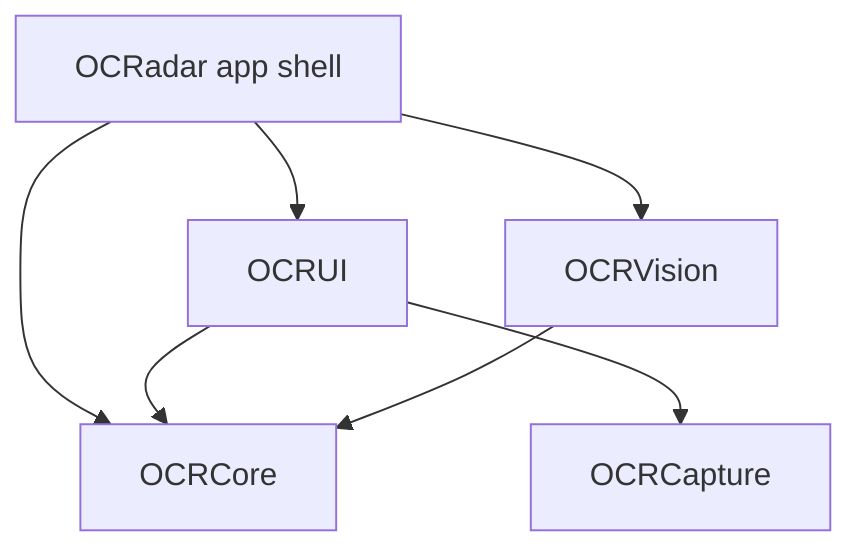

# OCRadar architecture

This document describes what is actually in the code: module responsibilities, the classifier seam, the model + manifest contract, the scan data flow, the concurrency model, and the end-to-end procedure for adding a new lesion class.

## Modules

The Xcode project contains one app target (`OCRadar`) plus a local Swift package, `OCRadarKit`, that holds all of the real code as four libraries.



| Module | Depends on | Responsibility |
|---|---|---|
| **OCRadar** (app shell) | OCRCore, OCRVision, OCRUI | `@main` entry point only: selects the classifier at launch, installs the SwiftData container for `ScanRecord`, and presents `RootView`. Also owns the asset catalog and the generated Info.plist keys (camera usage description, portrait-only, iPhone-only). One Swift file. |
| **OCRCore** | — | UI-free domain layer and the classifier seam: `LesionClassifying`, `ClassifierKind`, `ClassifierError`, `ModelManifest` (+ the `mockOralLesions` demo class set), `ClassificationResult` / `LabelScore`, `RiskLevel`, `ScanRecord` (SwiftData `@Model`), `MedicalDisclaimer`, and `MockLesionClassifier`. |
| **OCRCapture** | — | AVFoundation camera ownership: `CameraService` (session lifecycle, permission, still capture, interruption handling), `CameraPreview` (SwiftUI wrapper around `AVCaptureVideoPreviewLayer`), `CaptureError`. Notably independent of OCRCore. |
| **OCRVision** | OCRCore | The Core ML / Vision inference backend: `CoreMLLesionClassifier` (loads the bundled model + manifest, runs `VNCoreMLRequest`) and `ImagePreprocessing` (pure CoreGraphics/CoreVideo helpers used by tests and any future direct-`MLModel` path — the Vision path does its own `.centerCrop` and does not call them). |
| **OCRUI** | OCRCore, OCRCapture | Every screen and component: `RootView` (tab layout + disclaimer gate), `HomeView`, `ScanView`, `HistoryView`, `SettingsView`, `ResultView`, plus `GlassCard`, `RiskBadge`, `ScoreRow`, `Theme`, and `ImageResizing`. Compiled with MainActor default isolation. |

The load-bearing rule: **`OCRUI` never imports `OCRVision`.** The UI only knows the `LesionClassifying` protocol from OCRCore; the app shell is the single place where the concrete backend is chosen.

## The `LesionClassifying` seam

`OCRCore/LesionClassifying.swift` defines the seam:

```swift
public protocol LesionClassifying: Sendable {
    var kind: ClassifierKind { get }        // .coreML or .mock
    var manifest: ModelManifest { get }
    func classify(_ image: CGImage) async throws -> ClassificationResult
}
```

There are exactly two conformances:

- **`MockLesionClassifier`** (OCRCore) — deterministic stand-in. Scores are derived from a hash of the image's pixel dimensions (same-size input ⇒ identical output, regardless of pixel content), normalized into a probability distribution over `ModelManifest.mockOralLesions`'s five classes, after a simulated 200 ms delay so loading states are visible. Used when no model is bundled, and as the default in previews and tests.
- **`CoreMLLesionClassifier`** (OCRVision) — wraps a compiled Core ML model behind a `VNCoreMLRequest`.

### Mock-vs-CoreML selection at app start

`OCRadarApp.makeClassifier()` runs once, at process start:

```swift
if let model = CoreMLLesionClassifier.bundled() { return model }
return MockLesionClassifier()
```

`CoreMLLesionClassifier.bundled(in:)` looks in `Bundle.main` for `OralLesionClassifier.mlmodelc` (Xcode compiles the `.mlpackage` into this) and `ModelManifest.json`. It returns `nil` — and the app stays in demo mode — when either resource is missing or when initialization throws; failures are logged via `os.Logger` (subsystem `com.ocradar.OCRVision`), never crash the app.

The chosen instance is injected app-wide through a SwiftUI environment key declared in `RootView.swift`:

```swift
@Entry var lesionClassifier: any LesionClassifying = MockLesionClassifier()
```

The mock default means previews and tests need no wiring. The UI surfaces which backend is active: `HomeView` shows a "Demo mode — no trained model installed" card when `classifier.kind == .mock`, and `SettingsView` reports the engine as "Demo (mock)" vs "Core ML" alongside the manifest version and class list.

## The model + manifest contract

A trained model ships as **two files with exact, hard-coded names**, produced by `ml/ocradar_ml/export.py` and installed into `OCRadar/Resources/ML/` (the app target's synchronized folder puts them in the bundle automatically):

- `OralLesionClassifier.mlpackage` — an FP16 ML Program classifier. Preprocessing is baked in: the converter's `ImageType` applies `pixel/255 − mean` and the traced graph divides by the per-channel std and applies softmax, so the app feeds raw RGB pixels and reads calibrated class probabilities. The class labels are embedded via `ClassifierConfig`, in the order of the training run's `classes.json`. The exported model's own minimum deployment target is iOS 18 (the app targets iOS 26).
- `ModelManifest.json` — decoded by `OCRCore/ModelManifest.swift` (plain `Codable`, so JSON keys match the Swift property names exactly).

### `ModelManifest.json` fields

| Field | Type | Meaning | Validation (`ModelManifest.validate()`) |
|---|---|---|---|
| `schemaVersion` | Int | Manifest schema revision | Must be exactly `1` |
| `modelVersion` | String | Human-readable model version; shown on Home and in Settings, and stamped into every saved `ScanRecord` | — |
| `inputSize` | Int | Square model input side in pixels; the pipeline exports 384 (`ml/ocradar_ml/constants.py`) | Must be `> 0` |
| `classes` | Array of ClassInfo | Ordered class metadata, same order as the labels embedded in the model | Non-empty; `id`s must be unique |

Each ClassInfo object:

| Field | Type | Meaning |
|---|---|---|
| `id` | String | Stable identifier; **must match the class label embedded in the Core ML model** (which is the `data/train/` directory name) |
| `displayName` | String | Human-readable name shown throughout the UI |
| `riskLevel` | String | Exactly one of `low` \| `moderate` \| `high` (`RiskLevel` raw values); drives badge colors, result callouts, and sorting |
| `summary` | String | One-or-two-sentence plain-language description shown with results |

### Load-time cross-checks

`CoreMLLesionClassifier.init(modelURL:manifestURL:)` fails fast, in order:

1. Manifest decode failure ⇒ `ClassifierError.invalidManifest`.
2. `manifest.validate()` — the table above.
3. `MLModel` load failure ⇒ `ClassifierError.inferenceFailed`.
4. **Label agreement**: when the model declares `classLabels`, their set must equal the set of manifest `id`s, otherwise `invalidManifest` — this prevents scores silently mapping to the wrong classes.
5. `VNCoreMLModel` preparation failure ⇒ `inferenceFailed`.

At inference time, observations whose identifiers are absent from the manifest are dropped (`compactMap` in `classify`). Both sides of the contract carry mirror comments: `ml/labels.example.yaml` ↔ `ModelManifest.mockOralLesions`, and `constants.py`'s `INPUT_SIZE` ↔ `ModelManifest.inputSize`. If you change one side, change the other.

## Scan data flow

Capture through persistence, as implemented in `ScanView`:

1. **Session up.** The Scan tab's `.task` calls `CameraService.start()`: resolve camera permission, build the capture graph (back wide-angle input, `.photo` preset, photo output) on a private serial queue, publish `.running`. Denied / unavailable / failed states each render a dedicated fallback layer (Settings deep link, library-only picker, retry).
2. **Get a `CGImage`.** Two paths, both ending in an upright image with EXIF rotation baked into the pixels:
   - Shutter → `CameraService.capturePhoto()` → `AVCapturePhotoOutput` → `PhotoCaptureDelegate` → orientation-normalized `CGImage`.
   - `PhotosPicker` → `Data` → `UIImage` → `ImageResizing.uprightCGImage`.
3. **Review.** The captured image is shown full-screen with Retake / Analyze buttons.
4. **Classify.** `classifier.classify(image)` — the Core ML path runs the Vision request in a detached user-initiated task with `.centerCrop` scaling; the mock computes seeded scores after its fixed delay. The result is a `ClassificationResult`: scores always sorted most-probable first, plus `modelVersion` and `inferenceDuration`.
5. **Persist.** `ScanRecord(result:thumbnailData:)` denormalizes the top score into a SwiftData model — `topClassID`, `topClassName`, `riskLevelRaw`, `probability`, `modelVersion`, timestamp — plus a JPEG thumbnail (`ImageResizing.jpegThumbnail`, longest side ≤ 512 px, quality 0.8) stored via `@Attribute(.externalStorage)`. The initializer is failable and returns `nil` for an empty result, in which case nothing is saved. The record is inserted into the view's `modelContext`.
6. **Present.** A sheet shows `ResultView`: the analyzed image, top class with probability ring and risk badge, the manifest summary for the top class, every class score as a tinted bar, a professional-care callout (escalated styling when the tier is moderate or high), and the full medical disclaimer.
7. **History.** `HistoryView` renders `@Query(sort: \ScanRecord.timestamp, order: .reverse)` with swipe-to-delete and a detail screen (confidence, model version, absolute date, disclaimer).

Everything is local: there is no networking code anywhere in the app, and images/results only exist in the on-device SwiftData store.

## Concurrency model

- **MainActor by default in the UI.** Both the app target (`SWIFT_DEFAULT_ACTOR_ISOLATION = MainActor`) and the `OCRUI` package target (`.defaultIsolation(MainActor.self)` in `Package.swift`) compile with MainActor default isolation. `OCRCore`, `OCRCapture`, and `OCRVision` use standard (nonisolated) default isolation.
- **Camera work on a private serial queue.** `CameraService` is `@Observable @MainActor`: its observable `state` is only ever mutated on the main actor, while every `AVCaptureSession` mutation — configuration, `startRunning`/`stopRunning`, photo capture — runs on the dedicated serial queue `app.ocradar.capture.session`, bridged back with checked continuations. A start-generation counter makes `stop()` win races against an in-flight `start()` (including one parked on the permission prompt). Session notifications (interruption, interruption-ended, runtime error) are delivered on the main queue and re-enter the actor via `MainActor.assumeIsolated`. Photo-capture delegates are retained in a dictionary keyed by settings ID until their guaranteed final callback, because `AVCapturePhotoOutput` does not retain delegates.
- **Inference off the main thread.** The `LesionClassifying` contract requires `classify` to be safe from any actor and to do its work off the main thread. `CoreMLLesionClassifier` holds only immutable state (`MLModel` is documented thread-safe for prediction — hence the `@unchecked Sendable`, needed only because the wrapped framework types predate `Sendable`), and performs the Vision request inside `Task.detached(priority: .userInitiated)`. The mock suspends with `Task.sleep` and does pure computation.
- **SwiftData on the main context.** Views insert and delete `ScanRecord`s through the environment `modelContext` from MainActor-isolated code; the container is installed once in `OCRadarApp`.

## Adding a new lesion class end-to-end

No Swift changes are required as long as the new class uses one of the three existing risk tiers.

1. **Add data.** Create `ml/data/train/<class_id>/` with images (and the matching directory under `data/val/` if you keep an explicit val set — train and val must contain identical class directories). The directory name becomes the class `id` everywhere downstream.
2. **Add metadata.** Add an entry to your labels YAML (start from `ml/labels.example.yaml`): `displayName`, `riskLevel` (exactly `low`, `moderate`, or `high`), and `summary`. Keep the wording consistent with the screening-aid framing in `MedicalDisclaimer`.
3. **Retrain.** `python -m ocradar_ml.train --data data --labels <your>.yaml ...` — passing `--labels` verifies up front that every discovered class has metadata, so export cannot fail after hours of training. The run writes `classes.json`, whose (alphabetical, ImageFolder) order becomes the label order embedded in the model. Do not edit it.
4. **Export.** `python -m ocradar_ml.export --checkpoint runs/<exp>/best.pt --classes runs/<exp>/classes.json --labels <your>.yaml --model-version <bumped> --out dist` — emits the mlpackage with the new class embedded and a manifest that includes its metadata, in matching order.
5. **Install.** Copy `dist/OralLesionClassifier.mlpackage` and `dist/ModelManifest.json` into `OCRadar/Resources/ML/`, rebuild the app. The loader's label/manifest cross-check passes, and the UI picks the class up automatically — Settings' class list, ResultView's all-classes scores, the top-class summary, and risk badges are all rendered from the manifest.
6. **Optional: keep the demo set in sync.** The mock's class set (`ModelManifest.mockOralLesions` in OCRCore) mirrors `labels.example.yaml`; if the new class becomes part of the canonical set, update both, per the sync comments in each file.

The one case that does require Swift changes is a **new risk tier**: `RiskLevel` (OCRCore), its color mapping and display label (`Theme` in OCRUI), and the manifest/labels validation (`labels.py` accepts only `low`/`moderate`/`high`) would all need coordinated updates.
